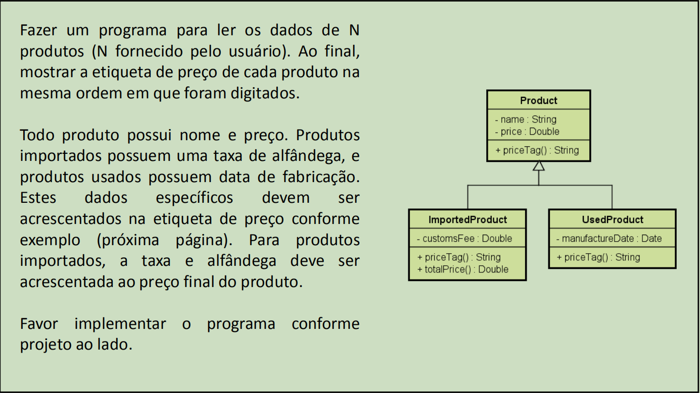
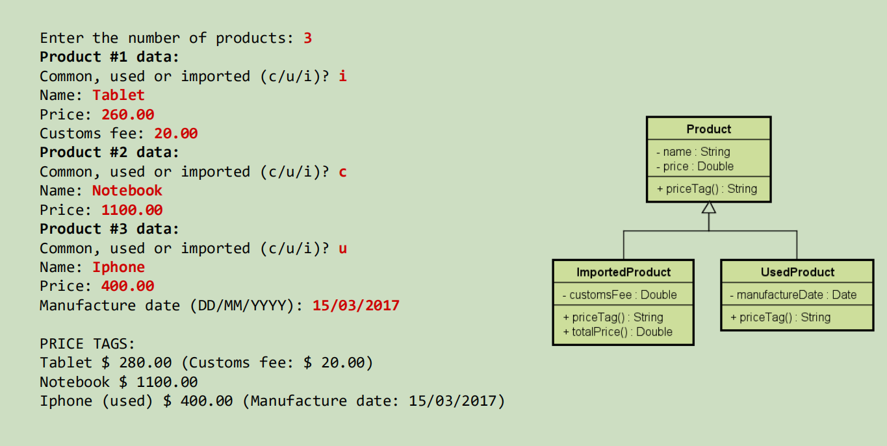
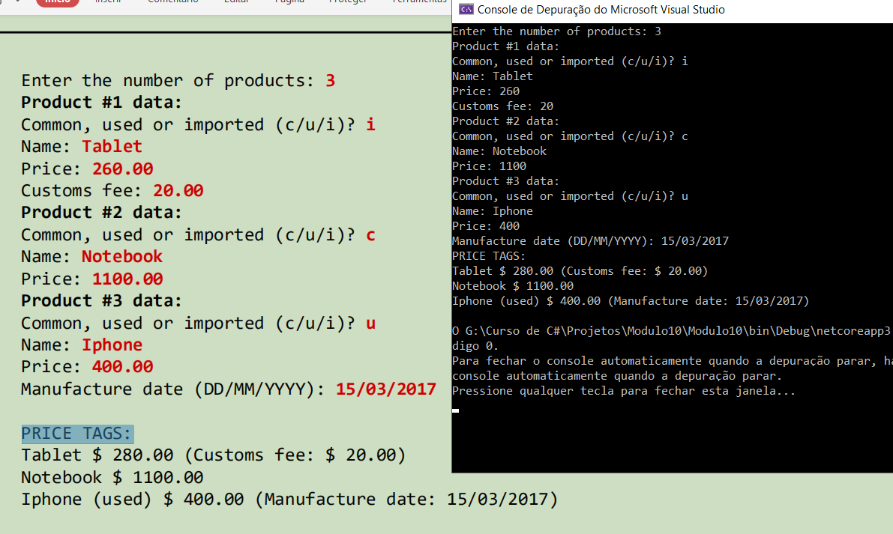

# Enumerações e Composição

É uma atividade do *Módulo 10* do curso de `C# Completo Programação Orientada a Objetos (POO)` Do professor `Nélio Alves`. 
Curso existente na plataforma [Udemy](https://www.udemy.com/course/programacao-orientada-a-objetos-csharp/).

* Entendendo e implementando os conceitos de Herança;
* Entendendo e implementando os conceitos de Polimorfismo;
* Entendendo e implementando os conceitos de Upcasting e Downcasting;
* Entendendo e implementando os conceitos de classes e métodos selados;
* Entendendo e implementando os conceitos de classes e métodos abstratos;
* Atividade relativa ao que foi aprendido no capitulo, segue exercício:

## Exercício

## Exemplo de Entrada

## Código em funcionamento

## Dados do Autor

Autor: `Matheus Glauber Rodrigues Jordão` [Linkedin](https://www.linkedin.com/in/matheusglauber/).
